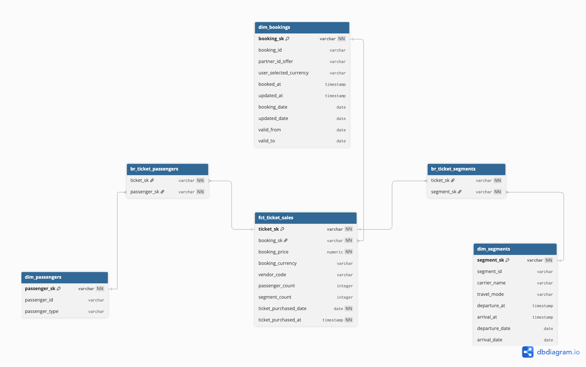

# Data Modeling Overview
Here we will discuss about the data modeling and motivation behind it. The strategy of this style is based on the given description of the sources and some assumptions. 

# Thought chain
To model the raw data provided, the goal is to create a star schema. To achieve this, we have to look what we want to build and whom it will serve. According to the description in the case study, we have booking events sourced from booking team. So booking team is the upstream stake holders and the consumer of the schema are business stake holders or people who will use this schema for reporting purpose. 

Assuming the downstream stakeholders are mostly non-technical persons who are more interested in results and speed of the result rather than the process. This helps us to decide how we want to design our star schema.

Another assumption could be, the downstream steakholders are interested to understand the performance of the product. According to the raw data proviedd, we can safely assume the focus is to understand revenue based performance as we have price information to calculate revenue.

Now, as our consumers want a robust revenue focused star schema for reporting and data exploration, we have to build a schema where data retival is easy and robust, and we can slice and dice revenue data based on different dimension.

To make this thought cristal clear, let's dive into the raw data context that is provided in the case study

# Raw Data and Context

The raw data structure contains 6 interrelated tables, which you’ll find below with real-world
context.

```Booking Table```

Column & Description

bookingid - Unique ID for the booking

createdAt - Timestamp when the booking was made

updatedAt - Last time the booking record changed

userSelectedCurrency - Currency selected by the user (e.g., EUR,USD)

partnerIdOffer -  External partner who facilitated the booking


***-- Context --*** Represents the top-level booking event. Think of this as the "transaction header" — it links out to passengers, tickets, and segments.

***-- Understanding --*** This is a table describing every bookings with partners' information. 

```Segment Table```

Column & Description

segmentid - Unique ID of the segment

bookingid - Links to the parent booking

carriername - Operator name

departuredatetime - Departure timestamp

arrivaldatetime - Arrival timestamp

travelmode - Type of transportation (e.g., flight, train, ferry)


***-- Context --*** Represents travel legs within a booking. A booking can have one or more segments.

***-- Understanding --*** This table describes mainly the mode of traveling for multiple trips.

```Passenger Table```

Column & Description

passengerId - Unique ID of the passenger

bookingid - Links to the booking

type - Passenger type (adult, child, infant)

***-- Context --*** Details each traveler in a booking. A booking usually includes one or more passengers.

***-- Understanding --*** Basic passenger details table.

```Ticket Table```

Column & Description

ticketid - Unique ID of the ticket

bookingid - Links to the booking

bookingPrice - Price paid

bookingCurrency - Currency used

vendorCode - Vendor/airline that fulfilled the ticket

***-- Context --*** Captures the actual ticket. A booking can include multiple tickets.

***-- Understanding --*** Ticket details table. Including price points for each ticket (Assumption).

```ticketSegment Table```

Column & Description

ticketId - ID of the ticket

segmentid - ID of the segment

***-- Context --*** Join table linking tickets to segments. A ticket might cover multiple travel segments (e.g., outbound + return).

***-- Understanding --*** Bridge table between tickets and segments. 

```ticketPassenger Table```

Column & Description

ticketId - ID of the ticket

passengerId - ID of the passenger


***-- Context --*** Join table linking tickets to passengers.This lets us map passengers to tickets, think of this as a receipt.

***-- Understanding --*** Bridge table between tickets and passenger. 

So the ERD looks something like the following-


# Final Thoughts

The provided model is ideal for operational data modeling. Easy and faster to write and update. But in our reporting context, we need something which is faster in reading the data. So designing a star schema make sense in terms of reporting and BI use cases.

Now, we have full context and interpretation of the context. From this, and the initial thought chain, we can understand that,
there are three granularities in this data. Segment, Ticket and Booking. Assuming the flow is Segment -> Ticket -> Booking. 

Another focus point is, we have a price point in the ticket table but the naming of the column is ambigious. One question can arise to understand the price, is it for each booking or each ticket? 

As there is a confusion, there could be multiple potential fact table for our star schema. 

If the price point is per booking, than making fact_booking will be easier and scalable. But if we want to analyze the lower granularities of Ticket and Segment, we can end up averaging out with the count of tickets and segments in each booking.

On the other hand if we pick fact_segment, it is unreal that the column name and table alignment will justify this case. 

Now, if we pick price point as per ticket, it is the most safest option to get different granular insights in a correct manner. How? Let's say, we want to roll up the grain to booking level, it's super easy. Yes, we still need to average out the segment dimension but this solution is closed to actual scenario rather than averaging out the lower grains.

So we can decide our central fact table will be ```fact_ticket_sales``` as we are focusing on revenue.

# Star Schema

As we have decide that our fact table will be ticket_sales, we now want to decide how our dimension will look like.

According to the raw tables, we can see we have three tables which we can consider as dimensions. Passengers, Segments and Bookings. 
These will be our dimensions because, if we want to slice and dice out revenue per segment or booking or passenger, we can easily get the ticket price and get most of the revenue KPIs easily. Also it makes sense to look into revenue, per passenger, per booking or per segment etc (Vendor, Partner, Carrier etc). 

But there is a simple catch, a booking can change. In this case, anything can change. Thus tracking these change will help us to analyze Point of Time metrics. For now, let's consider only booking dimension changes on the updated_at field. But as we want to track the history, we have to consider this as SCD type 2 and implement it with snapshot in dbt.

So here is our final proposed star schema ERD

