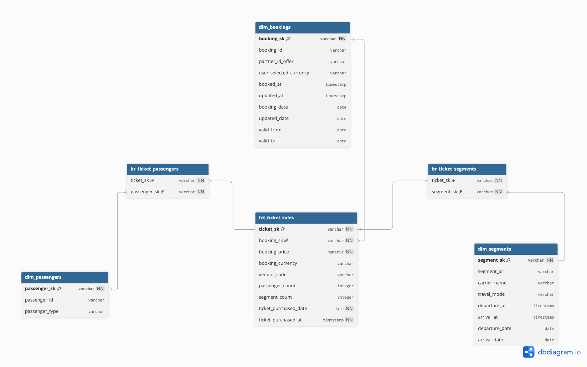

# Deliverables

Here we will focus on the deliverables that was asked in the doc. All the respective documents are linked here.

## 1 Data Modeling
- A star schema is built in this project. Check the [marts](/bookings_analytics/models/marts/core) folder under models.
Here is a high level ERD of the star schema


- Keys, relationships are defined in these files 

[_dim_core__models.yml](/bookings_analytics/models/marts/core/dimensions/_dim_core__models.yml)
[_fct_core__models.yml][/bookings_analytics/models/marts/core/facts/_fct_core__models.yml]

- Naming Conventions of this project is mostly based on dbt best practices. 

- Explanation of data modeling is described [here](/bookings_analytics/docs/data_modeling_overview.md)
- .yml files are added through out the modeling layers.

Bonus- The summary report is written [here](/bookings_analytics/models/marts/reports/rep_booking_summary.sql). It is a simple report just to showcase the usage.

## 2 Data Quality Testing

- Implementation and strategy of data quality checks are provided [here](/bookings_analytics/docs/data_quality_overview.md)
- Technical tests are written in .yml files. Business tests and time aware tests are custom macro functions. These can be found [here](/bookings_analytics/macros/tests)
- Pre-transform testing means, testing the source data. In this project it is implemented in [.yml file](bookings_analytics/models/staging/booking_activity/_stg_booking_activity__sources.yml)

- Post_transform testing means, testing the modeled data. All the tests for modeled data is provided in multiple .yml files under each marts folder.

Bonus- Spike detection test can be found [here](/bookings_analytics/macros/tests/test_volume_spike.sql)

## 3 Snapshots

- Snapshot model has been implemented in this [file](/bookings_analytics/snapshots/booking_snapshot.sql)
- Currently, the changes are detected by updated_at field and the strategy is ```timestamp```. The reason is, we only have one changing field now. If we want to detect other field changes we can change the strategy to ```check```

## 4 Pipelines

- The pipelines are written in this [file](/booking_analytics_orchestration/dags/booking_analytics_pipeline.py)
and the docs are provided [here](/booking_analytics_orchestration/README.md)

## 5 Communications

- The whole project consists of multiple documentation files. But summary is written [here](/bookings_analytics/models/docs/custom_overview.md). It is under the model folder because, when we run ```dbt docs generate && dbt docs serve```, it creates a local HTML and the overview is rendered. It makes the HTML ready to deploy. Also it works as a one pager for PMs