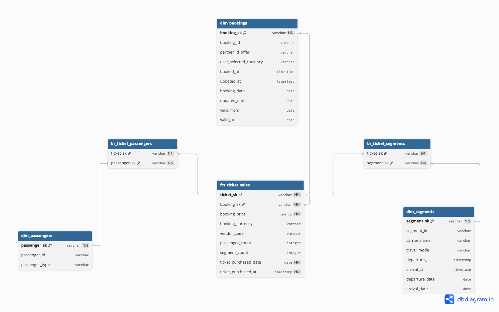
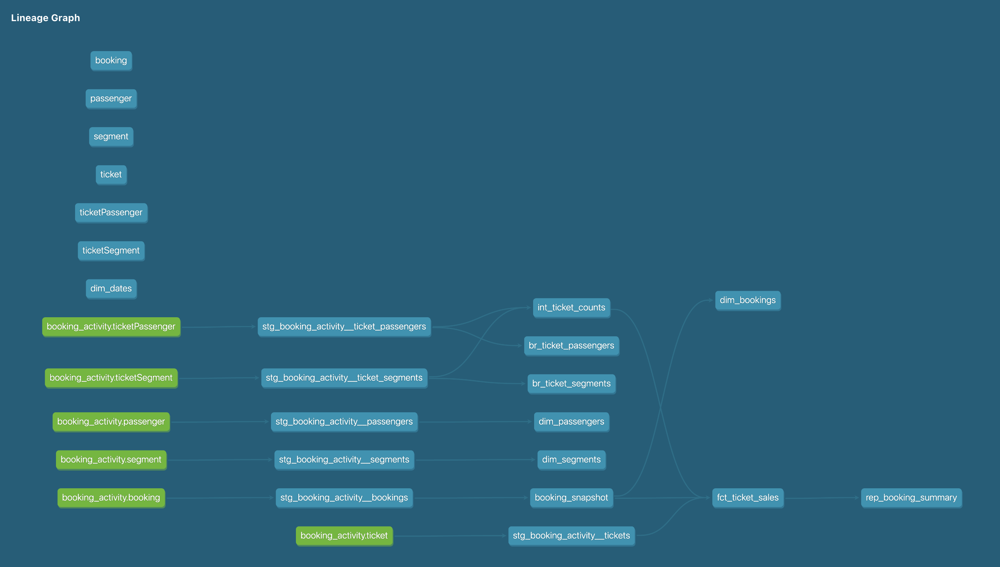


# Bookings Analytics

## Overview

This project transforms **raw travel booking data** into a **clean, trustworthy star schema** for business reporting and advanced analytics.

Using **dbt-core + PostgreSQL**:
- **Data is ingested daily** (via Airflow orchestrated pipeline).
- **Transformed into clean staging models** (one-to-one raw mapping).
- **Snapshotted for SCD2 history on bookings**.
- **Core marts built using star schema** for reporting and dashboards.

---

## Architecture

**Data Modeling**

**Purpose:**
Transform complex raw booking, ticket, segment, and passenger data into a clean, reliable star schema for fast, accurate revenue and volume reporting.

**Central Fact Table:**
Selected fact_ticket_sales (ticket-level pricing) as the fact table to align with revenue-focused KPIs while allowing easy roll-up to booking-level.

**Dimensions & Bridges:**

dim_bookings (with SCD2 snapshot tracking changes),

dim_passengers,

dim_segments,
with bridge tables for many-to-many joins.

**Why Star Schema:**

Optimized for fast querying in BI tools.

Supports slicing and dicing by partner, vendor, carrier, passenger type, travel mode.

Easy to calculate KPIs like ticket revenue, booking volume, avg passengers per booking.

**Transformation Workflow:**

**Seeds:** Loads synthetic raw CSV data for development.
**Staging (`stg_*`):** Data cleaning, column renaming, type casting, and validation.
**Snapshots:** Historical tracking of bookings via `updatedAt`.
**Intermediate (`int_*`):** Pre-aggregations and heavy joins.
**Marts:**
   - **Facts:** `fct_ticket_sales` (central revenue table).
   - **Dimensions:** `dim_bookings`, `dim_passengers`, `dim_segments`.
   - **Bridges:** `br_ticket_segments`, `br_ticket_passengers`.
**Reports:** Ad-hoc, sliceable reporting layers.

---

## Data Quality & Tests

**Framework aligned with Great Expectations:**

- Data Exists: Freshness and null checks at source.  
- Data is Correct: Type checks, value constraints, distribution checks.  
- Data is Consistent: Relationship (FK) tests across models.  
- Data is Fresh: Source freshness with warning/error thresholds.  
- Data is Complete: Row volume monitoring and spike detection.

**Test Examples:**
- `not_null`, `unique`, `relationships` on keys.
- Business logic tests:
   - Every booking has ≥1 passenger, ticket, segment.
   - Spike tests on daily ticket volumes.
   - Price within 3 stdev thresholds.

**All tests automated via dbt**

---

## KPIs Enabled

This star schema enables calculation of key business metrics:

| KPI | Explanation |
|---|---|
| **Booking Volume** | Number of bookings per day/week/month |
| **Ticket Revenue** | Total revenue from ticket sales |
| **Average Passengers per Booking** | Passengers divided by bookings |
| **Average Ticket Price** | Revenue divided by tickets sold |
| **Partner/Carrier Analysis** | Revenue by partner or carrier |
| **Segment Utilization** | Segments used per booking or per carrier |

All KPIs are sliceable by **date, mode of travel, currency, vendor, partner**.

---

## Trust & Exploration
- The data is tested at the very begining, so that no garbeg entry.
- Pipeline error detection is much easier as once the data is in the system, the rest only depends on transformation logic.
- Custom business logic is tested through out the fact and dimensional model.
- Exploration made easy with simple joins with surrogate_keys.

---

## Expectations

- Clean, robust **star schema for analytics**.
- Full **data quality enforcement** with tests.
- **Repeatable, scalable pipelines** (via Airflow + dbt).
- KPIs ready for **dashboarding and deep-dive analysis**.
- Trust and lineage available in **dbt Docs**.

